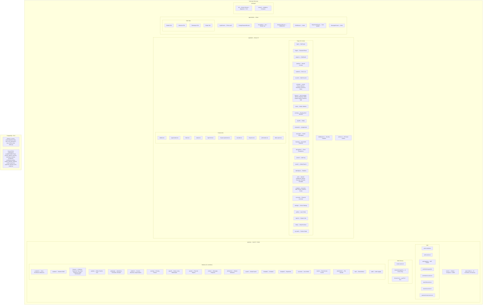
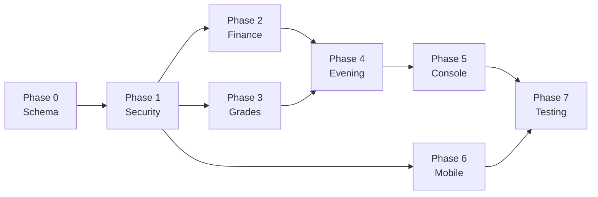

# El Ourwa — Migration Blueprint: PHP → Node/Next.js/Flutter

> **Purpose**: A comprehensive, phased roadmap for Claude Code to make the new Node.js/PostgreSQL/Next.js/Flutter app **feature-identical** to the original PHP/MySQL app, while adding multi-branch support, performance, and security improvements.

> [!IMPORTANT]
> **Read entirely before starting.** Every phase builds on the previous one. No phase should be started until its predecessor passes verification.

---

## Table of Contents

1. [Architecture Neural Network Maps](#1-architecture-neural-network-maps)
2. [Feature-by-Feature Gap Analysis](#2-feature-by-feature-gap-analysis)
3. [Flaw Report — New App](#3-flaw-report--new-app)
4. [Platform Console Enhancement Proposal](#4-platform-console-enhancement-proposal)
5. [Phased Implementation Plan](#5-phased-implementation-plan)
6. [Required Skills & Stack Knowledge](#6-required-skills--stack-knowledge)
7. [Security & Performance Improvements](#7-security--performance-improvements)
8. [Mathematical Task Decomposition](#8-mathematical-task-decomposition)

---

## 1. Architecture Neural Network Maps

### 1.1 Old App (PHP/MySQL) — Complete Map

```mermaid
graph TB
    subgraph ENTRY["Entry Points"]
        IDX["index.php<br/>→ Parent Login"]
        DIR["espace-direction.php<br/>→ Staff Login"]
        SIDI["sidibrahim.php<br/>→ Platform Console"]
    end

    subgraph AUTH["Authentication Layer"]
        AUTH_STAFF["includes/auth.php<br/>Argon2id + Sessions"]
        AUTH_PARENT["includes/parent_auth.php<br/>Phone Login + Sessions"]
        CSRF["includes/csrf.php"]
        PERMS["includes/permissions.php<br/>24 permissions, 6 roles"]
        SANITIZE["includes/sanitize.php"]
        SEC["includes/security_headers.php"]
    end

    subgraph ROLES["User Roles (multi-role)"]
        SA["super_admin"]
        ADMIN["admin"]
        COMPTABLE["comptable"]
        SECRETAIRE["secrétaire"]
        COLLECTEUR["collecteur_absence"]
        PROF["professeur"]
        PARENT["parent"]
    end

    subgraph ADMIN_PAGES["Admin Pages (43)"]
        TB["tableau_bord.php — Dashboard"]
        INSCR["inscrire_etudiant.php — Enrol Student"]
        REINSCR["reinscrire_etudiant.php — Re-enrol"]
        REINSCRIPTIONS["reinscriptions.php — Bulk Re-enrol"]
        SCOL["scolarite.php — Schooling Hub"]
        CDS["cours_du_soir.php — Evening Classes"]
        NOTES["saisir_notes.php — Enter Marks"]
        NOTES_E["notes_etudiants.php — View Marks"]
        FIN["finance.php — Finance Hub"]
        CAISSE["gestion_caisse.php — Cash Register (142KB!)"]
        DETTE["dette.php — Debt Management"]
        IMP["impayes.php — Unpaid Fees"]
        RAPPORT["rapport_financier.php — Financial Reports"]
        REVENUE["revenue_live.php — Live Revenue"]
        DEPENSES["depenses.php — Expenses"]
        ADMIN_PG["administrateurs.php — Admin Withdrawals"]
        PAY["paiement_staff.php — Staff Payroll"]
        GERER_NIV["gerer_niveaux.php — Manage Levels/Subjects"]
        GERER_GRP["gestion_groupes.php — Manage Classes"]
        GERER_ABS["gerer_absence.php — Attendance"]
        GERER_PROF["gerer_professeurs.php — Teachers"]
        BUL["bulletins_classe.php — Class Report Cards"]
        EDT["emploi_du_temps.php — Timetable"]
        EXERCICE["envoyer_exercice.php — Homework"]
        DEMANDES["demandes.php — Accountant Requests"]
        DEROGATIONS["derogations.php — Exam Exemptions"]
        HISTORIQUE["historique.php — Audit Log"]
        MESSAGERIE["messagerie.php — Parent Messaging"]
        RECHERCHE["recherche.php — Global Search"]
        PROFIL["modifier_profil.php — Profile"]
        STATS["statistiques.php — Statistics"]
        ANNEES["annees_scolaires.php — Academic Years"]
        COMPTES_P["comptes_parents.php — Parent Accounts"]
        COMPTES_S["comptes_staffs.php — Staff Accounts"]
        COMPTES_PR["comptes_profs.php — Teacher Accounts"]
        CREER_U["creer_utilisateur.php — Create User"]
        AJOUT_STAFF["ajouter_staff.php — Add Staff"]
        EXPELLED["expelled.php — Expulsions"]
    end

    subgraph TEACHER_PAGES["Teacher Pages (6)"]
        T_TB["tableau_bord.php"]
        T_CLASSES["mes_classes.php"]
        T_NOTES["saisir_notes.php"]
        T_EXER["envoyer_exercice.php"]
        T_REM["remarques.php"]
        T_EDT["emploi.php"]
    end

    subgraph PARENT_PAGES["Parent Pages (9)"]
        P_TB["tableau_bord.php"]
        P_ENFANT["enfant.php — Child Detail"]
        P_BULL["bulletin.php — Report Card"]
        P_ABS["absences.php"]
        P_EXERC["exercices.php"]
        P_MSG["messages.php"]
        P_REM["remarques.php"]
        P_RES["resultats.php"]
        P_MDP["changer_mdp.php"]
    end

    subgraph CORE_LOGIC["Core Business Logic"]
        INC_FIN["includes/finance.php<br/>Payments, Receipts, Debt"]
        INC_BUL["includes/bulletin.php<br/>Grade Computation"]
        INC_AN["includes/annee_scolaire.php<br/>Year Mapping"]
        INC_PAI["includes/paiements.php<br/>Payment Processing"]
        INC_ENC["includes/encaissement_inscription.php<br/>Enrollment Billing"]
        INC_REF["includes/referentiels.php<br/>Reference Data"]
        INC_ACC["includes/acces_examens.php<br/>Exam Access Control"]
        INC_PAR["includes/parent_scope.php<br/>Parent Data Scope"]
        INC_CACHE["includes/cache.php"]
        INC_UP["includes/upload.php"]
        INC_I18N["includes/i18n.php<br/>French/Arabic"]
        INC_NET["includes/reseau.php<br/>Network Utils"]
    end

    subgraph API_PHP["PHP AJAX API"]
        API_LOGIN["api/login.php"]
        API_ADD["api/ajouter_etudiant.php"]
        API_GRP["api/creer_groupe.php"]
        API_USR["api/creer_utilisateur.php"]
        API_NOTE["api/enregistrer_note.php"]
        API_STATS["api/stats_financieres.php"]
        API_PAR["api/parent/"]
    end

    subgraph DATABASE["MySQL Database (77 tables)"]
        direction LR
        DB_STRUCT["Structure: niveaux, groupes, matieres, enseignements"]
        DB_USERS["Users: utilisateurs, parents, etudiants, professeurs, staff"]
        DB_FINANCE["Finance: paiements, factures, recus, depenses, dettes, prets_personnel"]
        DB_GRADES["Grades: notes, bulletins, bulletin_lignes, bulletin_moyennes, bulletin_formules"]
        DB_ATTEND["Tracking: absences, remarques, exercices, notifications"]
        DB_ACCT["Accounting: compta_ecritures, compta_lignes, compta_journaux, caisse_jours"]
        DB_EVENING["Evening: cs_groupes, cs_inscriptions, cs_paiements, cs_emploi"]
        DB_SECURITY["Security: journal_securite, login_historique, roles, role_permissions"]
        DB_CONFIG["Config: configuration, annees_scolaires, annee_scolaire_mois"]
    end

    IDX --> AUTH_PARENT
    DIR --> AUTH_STAFF
    SIDI --> SIDI
    AUTH_STAFF --> PERMS
    PERMS --> ROLES
    ROLES --> ADMIN_PAGES
    ROLES --> TEACHER_PAGES
    AUTH_PARENT --> PARENT_PAGES
    ADMIN_PAGES --> CORE_LOGIC
    CORE_LOGIC --> DATABASE
    API_PHP --> CORE_LOGIC
```



### 1.2 New App (Node/Next.js/Flutter) — Complete Map



---

## 2. Feature-by-Feature Gap Analysis

### Legend
- ✅ = Fully implemented in new app
- ⚠️ = Partially implemented / needs work
- ❌ = Missing entirely

### 2.1 Core Structure

| Feature | PHP App | New App | Status | Gap Detail |
|---------|---------|---------|--------|------------|
| Academic Years | `annees_scolaires.php` + `annee_scolaire.php` | `settings/` + API | ✅ | |
| Levels Management | `gerer_niveaux.php` (41KB) | `scolarite/niveaux/` | ⚠️ | PHP has per-level tariff editing, fondamental-specific config, subject management all in one page. New app splits across pages |
| Groups Management | `gestion_groupes.php` | `scolarite/groupes/` | ⚠️ | PHP has inline student listing per group, capacity warnings |
| Subjects & Coefficients | Inline in `gerer_niveaux.php` | `scolarite/niveaux/` | ⚠️ | PHP allows inline coefficient editing, subject CRUD from same page |

### 2.2 Student Management

| Feature | PHP App | New App | Status | Gap Detail |
|---------|---------|---------|--------|------------|
| Student Enrollment | `inscrire_etudiant.php` (23KB) | `students/new/` | ⚠️ | PHP has complex fee calculation preview, enrollment billing inline |
| Student Re-enrollment | `reinscrire_etudiant.php` (52KB) | `re-enrol/` | ⚠️ | PHP has massive debt-aware re-enrollment with authorization checks |
| Bulk Re-enrollment | `reinscriptions.php` (44KB) | `re-enrol/` | ⚠️ | PHP has a complete batch workflow with debt authorization |
| Student Search | `recherche.php` (17KB) | `search/` | ⚠️ | PHP searches across students, parents, staff all at once |
| Student Detail | Inline in finance/notes pages | `students/` | ⚠️ | PHP has embedded student cards with full financial history |
| Expulsions | `expelled.php` | `scolarite/exclusions/` | ✅ | |

### 2.3 Finance (CRITICAL — 142KB gestion_caisse.php alone)

| Feature | PHP App | New App | Status | Gap Detail |
|---------|---------|---------|--------|------------|
| Cash Register (Caisse) | `gestion_caisse.php` (143KB!) | `finance/` | ⚠️ | PHP has a massive all-in-one cash register with inline payments, monthly breakdown, receipt printing, running totals. The new app splits this across multiple pages |
| Payment Recording | `finance.php` + `gestion_caisse.php` | `finance/` actions | ✅ | |
| Receipt Printing | `finance.php` → `recu_document()` | Not found | ❌ | **PHP has CSS-styled printable receipts. New app has no receipt document generation** |
| Debt Management | `dette.php` (45KB) | `finance/dettes/` | ⚠️ | PHP has comprehensive debt tracking with family debt history, debt write-offs, installment plans. Verify completeness |
| Unpaid Fees / Notifications | `impayes.php` | `finance/impayes/` | ✅ | |
| Financial Reports | `rapport_financier.php` (23KB) | `finance/rapport/` | ⚠️ | PHP has detailed printable reports with category breakdowns |
| Live Revenue Tracker | `revenue_live.php` (32KB) | `finance/revenue/` | ⚠️ | PHP has real-time daily breakdown, very rich |
| Expenses | `depenses.php` | `finance/depenses/` | ✅ | |
| Admin Withdrawals | `administrateurs.php` (23KB) | `finance/administrateurs/` | ⚠️ | PHP has monthly ceiling management, detailed withdrawal tracking |
| Staff Payroll | `paiement_staff.php` (31KB) | `payroll/` | ⚠️ | PHP has salary + loans + advances + installments all in one |
| Personal Loans | Inline in `paiement_staff.php` | `payroll/` | ⚠️ | Verify loan creation, installment tracking, repayment |
| Accounting Entries | `compta_ecritures`, `compta_lignes` | Not in schema | ❌ | **PHP has full double-entry bookkeeping tables. New app has none** |
| Daily Cash Summary | `caisse_jours` table | Not in schema | ❌ | **Missing daily cash closing/balancing** |
| Invoice System | `factures`, `facture_lignes`, `factures_annulees` | Not in schema | ❌ | **PHP has full invoice generation/annulment. New app has none** |
| Payment Methods | `moyens_paiement` | `payment_methods` | ✅ | |
| Concessions/Exemptions | `exemptions`, `reductions`, `parent_exemptions` | API concessions | ⚠️ | Verify all exemption types are handled |
| Ancillary Receipts | `encaissements_annexes` | Not in schema | ❌ | **Missing ancillary/miscellaneous receipt tracking** |

### 2.4 Grades & Pedagogy

| Feature | PHP App | New App | Status | Gap Detail |
|---------|---------|---------|--------|------------|
| Grade Entry | `saisir_notes.php` (25KB) | `notes/` | ✅ | |
| Bulletin Formulas | `bulletin_formules` table | Not in Drizzle schema | ❌ | **PHP has per-level per-term grade calculation formulas (weighted vs exam-only). Missing from new DB schema** |
| Report Card Generation | `bulletins_classe.php` + `bulletin.php` | `notes/` | ⚠️ | PHP has complex computation: average, rank, Arabic/French split for fondamental, coefficient weighting |
| Report Card Lines | `bulletin_lignes` table (7 grade columns) | Computed from `grades` | ⚠️ | PHP stores pre-computed lines. Verify new app computes correctly |
| Report Card Averages | `bulletin_moyennes` table | Computed live | ⚠️ | PHP stores per-student averages with Arabic/French separation |
| Student Notes View | `notes_etudiants.php` | Various note pages | ⚠️ | |
| Attendance Tracking | `gerer_absence.php` (13KB) | `scolarite/absence/` | ✅ | |
| Homework/Exercises | `envoyer_exercice.php` (11KB) | `homework/` | ✅ | |
| Teacher Remarks | `remarques.php` | `prof/remarques/` | ✅ | |
| Timetable | `emploi_du_temps.php` (19KB) | `scolarite/emploi/` | ✅ | |
| Exam Access Control | `derogations.php` + `acces_examens.php` | `derogations/` + `exams/` | ✅ | |

### 2.5 Evening Classes (Cours du Soir)

| Feature | PHP App | New App | Status | Gap Detail |
|---------|---------|---------|--------|------------|
| Evening Groups | `cs_groupes` table | `evening/` | ⚠️ | PHP has 89KB page — very complex. Verify all features ported |
| Evening Enrollments | `cs_inscriptions` | API evening module | ⚠️ | |
| Evening Payments | `cs_paiements` | API evening module | ⚠️ | |
| Evening Teacher Pay | `cs_paiements_profs` | `evening/professeurs/` | ⚠️ | |
| Evening Timetable | `cs_emploi` | Timetable module | ⚠️ | |
| External Teachers | `cs_profs_externes` | Not found | ❌ | **PHP supports external (non-staff) teachers for evening classes** |

### 2.6 Communication & Notifications

| Feature | PHP App | New App | Status | Gap Detail |
|---------|---------|---------|--------|------------|
| Parent Messaging | `messagerie.php` | `messages/` | ✅ | |
| In-app Notifications | `notifications` table + `notifier_parent()` | Not in schema | ❌ | **PHP has a notification system. New app has no notifications table** |
| Accountant Requests | `demandes.php` (18KB) | `requests/` | ✅ | |
| Read Receipts | In `messages` table | Mobile API | ✅ | |

### 2.7 User & Account Management

| Feature | PHP App | New App | Status | Gap Detail |
|---------|---------|---------|--------|------------|
| User Creation | `creer_utilisateur.php` (18KB) | `comptes/creer/` | ✅ | |
| Parent Accounts | `comptes_parents.php` (11KB) | `comptes/parents/` | ✅ | |
| Staff Accounts | `comptes_staffs.php` (35KB) | `comptes/staff/` | ⚠️ | PHP has 35KB of complex staff management. Verify completeness |
| Teacher Accounts | `comptes_profs.php` (10KB) | `comptes/professeurs/` | ✅ | |
| Profile Editing | `modifier_profil.php` | `profile/` | ✅ | |
| Password Reset | `reinitialiser_mdp.php` | `forgot/` | ✅ | |
| Role Management | `permissions.php` (24 permissions) | API permissions | ✅ | |

### 2.8 Reports & Exports

| Feature | PHP App | New App | Status | Gap Detail |
|---------|---------|---------|--------|------------|
| Financial Reports | `rapport_financier.php` | `finance/rapport/` + `reports/` | ⚠️ | |
| Statistics Dashboard | `statistiques.php` | `statistiques/` | ⚠️ | |
| Print Support | `window.print()` everywhere | `print-button.tsx` | ⚠️ | PHP has extensively formatted print CSS. Verify new app matches |
| Audit History | `historique.php` | `journal/` | ✅ | |
| Table Export | Inline CSV/print | `table-export.tsx` | ✅ | |

### 2.9 Platform Console

| Feature | PHP App | New App | Status | Gap Detail |
|---------|---------|---------|--------|------------|
| Platform Login | `sidibrahim.php` (hardcoded hash) | JWT platform admin flag | ✅ | Properly improved |
| Student Count | Shows total enrolled | Shows per-branch | ✅ | |
| Billing Calculation | students × TARIF_PAR_ELEVE | Combined finance view | ⚠️ | PHP shows monthly/annual billing projection. New app shows collected/expenses but no SaaS billing |
| Per-Group Breakdown | Table with level/group/count/amount | Not present | ❌ | **PHP shows detailed per-class-group billing table. Missing from new app** |
| Branch Management | N/A (single school) | Create + Enter branches | ✅ | New feature |
| Branch Impersonation | N/A | 30-min audited sessions | ✅ | New feature |
| Print Report | `window.print()` styled | No print | ❌ | **PHP has printable billing report** |

### 2.10 Parent Portal (Mobile App)

| Feature | PHP App | New App | Status | Gap Detail |
|---------|---------|---------|--------|------------|
| Parent Login | Phone + Password | Phone + Password | ✅ | |
| Dashboard | `tableau_bord.php` | `DashboardScreen` | ✅ | |
| Child Detail | `enfant.php` (19KB) | `ChildScreen` + tabs | ⚠️ | PHP shows much more financial data per child. Mobile hides it intentionally |
| Report Card | `bulletin.php` + `resultats.php` | `ReportCardScreen` | ✅ | |
| Absences | `absences.php` | `AbsencesTab` | ✅ | |
| Homework | `exercices.php` | `ExercicesTab` | ✅ | |
| Messages | `messages.php` | `MessagesScreen` | ✅ | |
| Remarks | `remarques.php` | `RemarquesTab` | ✅ | |
| Schedule | N/A (not in PHP parent) | `EmploiTab` | ✅ | New improvement |
| Password Change | `changer_mdp.php` | `ChangePasswordScreen` | ✅ | |
| Push Notifications | N/A | N/A | ❌ | **Neither app has push notifications** |
| Offline Mode | N/A | N/A | ❌ | **No offline support** |

---

## 3. Flaw Report — New App

> [!CAUTION]
> These are confirmed issues found during analysis. Each must be fixed.

### 3.1 Critical Flaws

| # | Flaw | Severity | Fix |
|---|------|----------|-----|
| F1 | **CORS is wide open**: `origin: (origin, cb) => cb(null, true)` in `main.ts` accepts ALL origins | 🔴 Critical | Replace with whitelist: `origin: ['https://nour.elourwa.com', 'https://rissala.elourwa.com']` or regex matching `*.elourwa.com`. Use env config for allowed origins |
| F2 | **No notifications table in PostgreSQL schema**: The PHP app has a `notifications` table for parent alerts. Drizzle schema in `packages/db/src/schema.ts` has none | 🔴 Critical | Add `notifications` table with `school_id`, RLS policy, and parent-scoped queries |
| F3 | **No accounting/bookkeeping tables**: PHP has `compta_ecritures`, `compta_lignes`, `compta_journaux`, `compta_plan`, `compta_stats`, `compta_tiers`. None exist in new schema | 🟡 High | Add double-entry bookkeeping tables or decide if append-only payment log replaces this |
| F4 | **No bulletin_formules equivalent**: PHP has per-level per-term grade calculation configuration. New schema has no equivalent | 🔴 Critical | Add `grade_formulas` table: `school_id, level_id, term, coursework_weight, exam_weight, divisor, calculation_mode` |
| F5 | **No invoice system**: PHP has `factures`, `facture_lignes`, `factures_annulees`. New app has no invoice concept | 🟡 High | Decide: add invoice tables or confirm that receipt-based tracking replaces invoicing |
| F6 | **No daily cash summary**: PHP has `caisse_jours` for daily cash closing. New app has none | 🟡 High | Add `daily_summaries` table or implement as computed view |
| F7 | **No receipt document printing**: PHP generates styled, printable receipt documents via `recu_document()`. New app has no equivalent | 🟡 High | Implement receipt template in Next.js with `@media print` CSS or server-side PDF generation |
| F8 | **No external evening teachers**: PHP supports `cs_profs_externes` for non-staff teachers. New app doesn't handle this | 🟡 Medium | Add to evening module's teacher management |

### 3.2 Moderate Flaws

| # | Flaw | Severity | Fix |
|---|------|----------|-----|
| F9 | **No push notifications in mobile**: The app relies on badge polling. Parents in Mauritania may not check frequently | 🟡 Medium | Add Firebase Cloud Messaging (FCM) or OneSignal for push notifications |
| F10 | **No offline mode in mobile**: Parents in Nouakchott face unreliable connectivity | 🟡 Medium | Add Hive/SQLite local cache for last-viewed data |
| F11 | **`actions.ts` is a 1650-line monolith**: All 65 server actions in one file | 🟡 Medium | Split into domain modules: `finance-actions.ts`, `academic-actions.ts`, etc. |
| F12 | **No `Effectifs_annuels` equivalent**: PHP tracks yearly enrollment snapshots. New app doesn't | 🟡 Medium | Add `enrollment_snapshots` or compute from enrollment history |
| F13 | **No ancillary receipts**: PHP has `encaissements_annexes` for miscellaneous income. Missing | 🟡 Medium | Add `misc_receipts` table or fold into `payments` with a type flag |
| F14 | **`unsafe-inline` in CSP for production**: The middleware keeps `'unsafe-inline'` for scripts | 🟡 Medium | Thread nonces through Next.js document to remove `unsafe-inline` |
| F15 | **No rate limiting middleware on API**: `rate-limit.service.ts` exists but no global Fastify plugin | 🟡 Medium | Add `@fastify/rate-limit` with per-IP and per-user limits |
| F16 | **Today and My-Week pages have no PHP equivalent**: `today/` and `my-week/` are new and may lack coverage | 🟢 Low | Keep as improvements, ensure they work correctly |

---

## 4. Platform Console Enhancement Proposal

> Based on research of Fedena, OpenSIS, PowerSchool, Gibbon, Classe365, and best-practice SaaS school platforms.

### 4.1 Current State
The platform console (`/platform`) currently offers:
- Branch listing with student count and collected revenue
- Branch creation (instant deployment)
- Branch impersonation (30-min, audited, RLS-scoped)
- Combined finance overview

### 4.2 Proposed Enhancements

#### Phase A: Core Analytics Dashboard
```
┌─────────────────────────────────────────────────────────┐
│  Console des branches — Vue d'ensemble                   │
├──────────┬──────────┬───────────┬───────────────────────┤
│ Branches │ Élèves   │ Revenue   │ Dépenses   │ Net     │
│    3     │   4,217  │ 32.5M MRU │ 18.2M MRU  │ 14.3M  │
├──────────┴──────────┴───────────┴───────────────────────┤
│                                                          │
│  📊 Revenue par branche          📈 Tendance mensuelle   │
│  ┌────────────────────┐         ┌────────────────────┐  │
│  │ Bar chart           │         │ Line chart          │  │
│  │ per-branch revenue  │         │ 12-month trend      │  │
│  └────────────────────┘         └────────────────────┘  │
│                                                          │
│  📋 Détail par branche                                   │
│  ┌──────────────────────────────────────────────────────┐│
│  │ Name │ Students │ Teachers │ Collected │ Debt │ Rate ││
│  │ Nour │   1,372  │    45    │  18.5M    │ 2.1M │ 89% ││
│  │ Riss │     890  │    32    │  10.2M    │ 1.3M │ 87% ││
│  │ Salam│   1,955  │    58    │   3.8M    │ 0.8M │ 82% ││
│  └──────────────────────────────────────────────────────┘│
│                                                          │
│  🔧 Facturation SaaS                                    │
│  ┌──────────────────────────────────────────────────────┐│
│  │ Branch  │ Students │ Rate    │ Monthly  │ Annual    ││
│  │ Nour    │  1,372   │ 500 MRU │ 686,000  │ 8.2M     ││
│  │ Rissala │    890   │ 500 MRU │ 445,000  │ 5.3M     ││
│  │ Salam   │  1,955   │ 500 MRU │ 977,500  │ 11.7M    ││
│  │ TOTAL   │  4,217   │         │ 2.1M     │ 25.3M    ││
│  └──────────────────────────────────────────────────────┘│
└─────────────────────────────────────────────────────────┘
```

#### Phase B: New Functionalities

| Feature | Description | Priority |
|---------|-------------|----------|
| **SaaS Billing Dashboard** | Per-branch billing: students × rate, monthly projection, annual projection, payment status tracking | 🔴 High |
| **Per-Group Breakdown** (from PHP) | Restore the per-level, per-group student count table that `sidibrahim.php` had | 🔴 High |
| **Collection Rate KPI** | `(total_collected / total_billed) × 100` per branch, with trend sparklines | 🔴 High |
| **Branch Health Score** | Composite metric: collection rate + attendance + grade average | 🟡 Medium |
| **Comparative Analytics** | Side-by-side branch comparison: enrollment trends, financial performance, academic results | 🟡 Medium |
| **Branch Onboarding Wizard** | Step-by-step: create branch → set up levels/groups → import teachers → configure billing | 🟡 Medium |
| **Audit Timeline** | Cross-branch activity feed: recent impersonations, branch creations, admin appointments | 🟡 Medium |
| **Debt Summary** | Platform-wide outstanding debt by branch, with aging (30/60/90 days) | 🟡 Medium |
| **Teacher Allocation** | Cross-branch view: which teachers teach where, hours per branch | 🟢 Low |
| **White-label Settings** | Per-branch: logo, colors, receipt header, custom domain management | 🟢 Low |
| **Platform Print Report** | Styled printable billing/enrollment report (restoring PHP capability) | 🔴 High |
| **Notification Center** | Platform-wide broadcast to all branch admins | 🟢 Low |
| **Subscription Management** | Track which branches are paid up, suspend inactive ones | 🟢 Low |
| **Data Export** | CSV/Excel export of platform-wide data for each metric | 🟡 Medium |

---

## 5. Phased Implementation Plan

> [!IMPORTANT]
> Mathematical decomposition: The entire migration has **~157 discrete tasks** organized into **7 phases**. Each phase is subdivided into **work packages (WP)** of 3–8 tasks, designed to be completed in a single Claude Code session.

### Phase 0: Foundation & Schema Alignment ⬜
**Goal**: Bring the PostgreSQL schema to parity with MySQL's 77 tables.
**Duration**: ~3 sessions

#### WP 0.1 — Missing Tables (Critical)
- [ ] Add `notifications` table with RLS
- [ ] Add `grade_formulas` table (equivalent of `bulletin_formules`) with RLS
- [ ] Add `daily_summaries` / `caisse_jours` equivalent with RLS
- [ ] Add Drizzle schema entries for all new tables

#### WP 0.2 — Missing Tables (High)
- [ ] Add `invoices` + `invoice_lines` if needed (or document why receipts replace them)
- [ ] Add `ancillary_receipts` / `encaissements_annexes` equivalent
- [ ] Add `enrollment_snapshots` / `effectifs_annuels` equivalent
- [ ] Add `evening_external_teachers` / `cs_profs_externes` equivalent

#### WP 0.3 — Schema Audit
- [ ] Compare all 77 PHP tables against PostgreSQL schema column-by-column
- [ ] Ensure all indexes from `RECOMMANDATION_INDEX.sql` have PostgreSQL equivalents
- [ ] Verify all foreign keys are composite (scoped by `school_id`)
- [ ] Write migration SQL files for all additions

#### WP 0.4 — Accounting Decision
- [ ] Decide: port full `compta_*` tables or replace with append-only ledger view
- [ ] If porting: add `accounting_entries`, `accounting_lines`, `accounting_journals`, `chart_of_accounts` with RLS
- [ ] If not: document why and how financial reports still work

### Phase 1: Security Hardening ⬜
**Goal**: Close all security gaps before any feature work.
**Duration**: ~2 sessions

#### WP 1.1 — API Security
- [ ] Fix CORS: Replace `origin: true` with domain whitelist from env
- [ ] Add `@fastify/rate-limit` with per-IP (100/min) and per-user (300/min) limits
- [ ] Add `@fastify/helmet` for security headers on API responses
- [ ] Verify all endpoints require authentication (except health, login)

#### WP 1.2 — Frontend Security
- [ ] Remove `'unsafe-inline'` from production CSP by threading nonces
- [ ] Add CSRF validation on all form submissions (verify Server Actions have implicit CSRF)
- [ ] Verify no sensitive data in URL parameters
- [ ] Add session fingerprinting (User-Agent + IP prefix hash, matching PHP's `auth.php`)

#### WP 1.3 — Mobile Security
- [ ] Verify certificate pinning options for production
- [ ] Add biometric unlock option for returning users
- [ ] Implement token encryption at rest (beyond flutter_secure_storage defaults)

### Phase 2: Finance Module Completion ⬜
**Goal**: Achieve 100% parity with PHP's finance system.
**Duration**: ~5 sessions

#### WP 2.1 — Cash Register Parity
- [ ] Port `gestion_caisse.php` logic: daily cash view, running totals, daily close
- [ ] Implement daily summary creation/closing workflow
- [ ] Add monthly breakdown view matching PHP's layout
- [ ] Test against PHP's financial figures (reconciliation)

#### WP 2.2 — Receipt Document Generation
- [ ] Create receipt template matching PHP's `recu_document()` layout
- [ ] Implement `@media print` CSS for receipt printing
- [ ] Add receipt number display and formatting
- [ ] Consider server-side PDF generation as alternative

#### WP 2.3 — Debt Management Completion
- [ ] Verify debt calculation matches PHP's `dette.php` logic exactly
- [ ] Port family debt history view
- [ ] Port debt write-off workflow
- [ ] Port installment plan tracking
- [ ] Add debt aging report (30/60/90 days)

#### WP 2.4 — Financial Reports
- [ ] Port `rapport_financier.php` report format
- [ ] Add printable report layouts
- [ ] Port revenue breakdown by category (tuition, enrollment, supplies, etc.)
- [ ] Verify monthly/annual totals match PHP output

#### WP 2.5 — Staff Financial Features
- [ ] Verify payroll workflow matches `paiement_staff.php`
- [ ] Port loan management (creation, installments, repayment tracking)
- [ ] Port admin withdrawal management with monthly ceilings
- [ ] Verify salary advance tracking

### Phase 3: Grades & Bulletin System ⬜
**Goal**: Ensure report cards are computed identically to PHP.
**Duration**: ~3 sessions

#### WP 3.1 — Grade Formula Engine
- [ ] Implement `grade_formulas` CRUD (per level, per term)
- [ ] Support both `examen_seul` and `pondere` calculation modes
- [ ] Verify coefficient weighting matches PHP's `bulletin_formules`
- [ ] Write unit tests for all grade computation paths

#### WP 3.2 — Report Card Generation
- [ ] Port `bulletin.php` computation: subject lines → averages → ranks
- [ ] Handle fondamental-specific Arabic/French total separation
- [ ] Port class-wide bulletin generation (`bulletins_classe.php`)
- [ ] Verify ranks are computed identically

#### WP 3.3 — Report Card Display
- [ ] Create printable bulletin template matching PHP layout
- [ ] Support term-by-term navigation
- [ ] Handle `-1` (absent) marker correctly in all views
- [ ] Test with real data against PHP output

### Phase 4: Evening Classes & Missing Features ⬜
**Goal**: Complete all remaining feature gaps.
**Duration**: ~3 sessions

#### WP 4.1 — Evening Classes Completion
- [ ] Verify all 89KB of `cours_du_soir.php` functionality is ported
- [ ] Add external teacher management
- [ ] Port evening class billing and payments
- [ ] Port evening timetable management

#### WP 4.2 — Notification System
- [ ] Implement notifications table + API endpoints
- [ ] Port `notifier_parent()` equivalent: trigger on grades, absences, messages
- [ ] Add notification display in parent mobile app
- [ ] Add unread notification count in dashboard

#### WP 4.3 — Search & Misc
- [ ] Verify global search covers students, parents, staff (like PHP's `recherche.php`)
- [ ] Port student detail views with complete financial history
- [ ] Verify all 43 admin pages have equivalent functionality
- [ ] Port remaining inline features from `gestion_caisse.php`

### Phase 5: Platform Console Enhancement ⬜
**Goal**: Upgrade the platform console beyond PHP's `sidibrahim.php`.
**Duration**: ~2 sessions

#### WP 5.1 — Restore PHP Features
- [ ] Add per-group student breakdown table (from `sidibrahim.php`)
- [ ] Add SaaS billing projection (students × rate, monthly, annual)
- [ ] Add printable platform report
- [ ] Add configurable per-student tariff

#### WP 5.2 — New Analytics
- [ ] Add collection rate KPI per branch
- [ ] Add revenue trend charts (12-month)
- [ ] Add comparative branch analytics
- [ ] Add debt summary with aging
- [ ] Add cross-branch audit timeline

#### WP 5.3 — Operational Features
- [ ] Add branch onboarding wizard
- [ ] Add branch suspension/reactivation
- [ ] Add white-label settings per branch
- [ ] Add platform-wide data export

### Phase 6: Mobile App Enhancement ⬜
**Goal**: Add missing mobile features.
**Duration**: ~2 sessions

#### WP 6.1 — Push Notifications
- [ ] Integrate Firebase Cloud Messaging
- [ ] Send push on: new grade, new message, new homework, absence recorded
- [ ] Handle notification tapping (deep link to relevant screen)

#### WP 6.2 — Offline & Performance
- [ ] Add Hive-based local cache for last-viewed data
- [ ] Show cached data with staleness indicator when offline
- [ ] Add pull-to-refresh on all screens
- [ ] Optimize API calls (batch requests where possible)

### Phase 7: Testing & Reconciliation ⬜
**Goal**: Prove the new app produces identical results to the PHP app.
**Duration**: ~3 sessions

#### WP 7.1 — Financial Reconciliation
- [ ] Run parity checks: import PHP data, verify all payment totals match
- [ ] Verify receipt number sequences
- [ ] Verify debt calculations for all 1,372 families
- [ ] Verify staff payroll totals

#### WP 7.2 — Grade Reconciliation
- [ ] Verify all ~139,000 grade records compute identical averages
- [ ] Verify report card ranks match
- [ ] Verify fondamental Arabic/French totals match

#### WP 7.3 — End-to-End Testing
- [ ] Playwright E2E tests for critical flows: enrollment → payment → receipt
- [ ] Playwright tests for all 51 pages
- [ ] Mobile integration tests for parent flows
- [ ] Load testing: simulate 10,000+ concurrent students

---

## 6. Required Skills & Stack Knowledge

### Backend (NestJS API)
| Skill | Why Required |
|-------|-------------|
| **NestJS** (controllers, services, guards, interceptors, pipes) | Core API framework |
| **PostgreSQL** + **Row-Level Security** | Multi-tenant data isolation |
| **Drizzle ORM** | Type-safe schema & queries |
| **Zod validation** | Input validation on all endpoints |
| **JWT ES256** (elliptic curve) | Token-based authentication |
| **Argon2id + bcrypt** | Password hashing with legacy migration |
| **Fastify** (compress, multipart, rate-limit) | HTTP server layer |
| **pg (node-postgres)** | Direct PostgreSQL connection + pool management |
| **Multi-tenant architecture** | `school_id` scoping, RLS policies |
| **Financial domain knowledge** | Append-only ledgers, receipt sequences, debt computation |
| **Double-entry bookkeeping** (if porting compta tables) | Accounting system design |

### Frontend (Next.js)
| Skill | Why Required |
|-------|-------------|
| **Next.js 15 App Router** | Pages, layouts, middleware, server components |
| **React Server Components** | Data fetching pattern used exclusively |
| **Server Actions** | All form submissions |
| **CSS (custom, no Tailwind)** | The app uses handcrafted CSS matching El Ourwa's design |
| **Chart.js** | Financial and demographic charts |
| **Print CSS / `@media print`** | Receipts, reports, bulletins |
| **i18n (RTL/LTR)** | Arabic support with `dir="rtl"` |
| **Accessibility** | ARIA labels, semantic HTML |

### Mobile (Flutter)
| Skill | Why Required |
|-------|-------------|
| **Flutter** (StatefulWidget, FutureBuilder) | Core mobile framework |
| **flutter_secure_storage** | Token persistence |
| **HTTP client** with token rotation | API communication |
| **Firebase Cloud Messaging** (for push) | Notifications enhancement |
| **Hive/SQLite** (for offline) | Local caching |
| **RTL support** | Arabic layout |

### DevOps & Infrastructure
| Skill | Why Required |
|-------|-------------|
| **Docker / docker-compose** | Local development environment |
| **Turborepo** | Monorepo build orchestration |
| **PostgreSQL administration** | Migrations, RLS policies, indexes |
| **Playwright** | E2E testing |
| **Vitest** | Unit/integration testing |

---

## 7. Security & Performance Improvements

### 7.1 Security Improvements Over PHP

| Area | PHP App | New App (Current) | Recommended |
|------|---------|-------------------|-------------|
| Password Hash | Argon2id | Argon2id + bcrypt fallback | ✅ Keep — transparent re-hash is excellent |
| Session Auth | PHP sessions + cookie | JWT ES256 + refresh token rotation | ✅ Better — stateless, rotatable |
| CSRF | Manual token per form | Server Actions (implicit) | ⚠️ Verify Server Actions provide CSRF |
| Multi-tenancy | N/A (single DB) | PostgreSQL RLS + composite FKs | ✅ Excellent — structural isolation |
| Brute Force | IP + account lockouts | `rate-limit.service.ts` exists | ⚠️ Add global Fastify rate-limit plugin |
| XSS | `htmlspecialchars()` | React auto-escaping | ✅ Better |
| SQL Injection | PDO prepared statements | Parameterized queries | ✅ Equal |
| CORS | N/A (same-origin) | **Wide open** | 🔴 FIX: whitelist domains |
| CSP | Custom headers | Next.js middleware | ⚠️ Remove `unsafe-inline` |
| Data Encryption | N/A | Should add field-level AES-256-GCM | 🟡 Add for PII fields |

### 7.2 Performance Improvements

| Area | Recommendation |
|------|---------------|
| **Database** | Add `pg_stat_statements` monitoring. Ensure all tenant queries hit `(school_id, ...)` composite indexes. Add connection pooling with PgBouncer for >5 branches |
| **Caching** | Add Redis for: session metadata, grade formulas (change rarely), reference data (levels, groups, subjects). TTL: 5 min for mutable, 1 hour for reference |
| **API Compression** | Already using `@fastify/compress` with Brotli — excellent |
| **Next.js** | Use `generateStaticParams` for static reference pages. Enable ISR for public pages. Implement streaming for large data tables |
| **Mobile** | Implement pagination for large lists (grades, absences). Cache API responses with ETag support. Use `ListView.builder` for all scrollable lists |
| **Search** | Consider PostgreSQL full-text search (`tsvector`) for global search instead of `LIKE` queries |
| **Background Jobs** | Use BullMQ for: report generation, bulk notifications, grade computation, data exports. Never inline heavy work in request handlers |
| **CDN** | Serve static assets (CSS, fonts) through Cloudflare CDN. Add immutable cache headers with content hashing |

---

## 8. Mathematical Task Decomposition

### The Decomposition Model

Using a **Weighted Shortest Job First (WSJF)** model adapted for this migration:

$$\text{Priority Score} = \frac{\text{Business Value} + \text{Risk Reduction}}{\text{Effort (sessions)}}$$

Where:
- **Business Value** (1–10): Impact on school operations
- **Risk Reduction** (1–10): Impact on data integrity/security
- **Effort**: Estimated Claude Code sessions

### Priority Matrix

| Phase | WSJF Score | Order | Tasks | Sessions |
|-------|-----------|-------|-------|----------|
| Phase 0: Schema Alignment | (9+8)/3 = 5.7 | 1st | 16 | 3 |
| Phase 1: Security | (7+10)/2 = 8.5 | 2nd | 12 | 2 |
| Phase 2: Finance | (10+9)/5 = 3.8 | 3rd | 25 | 5 |
| Phase 3: Grades | (9+8)/3 = 5.7 | 4th | 14 | 3 |
| Phase 4: Evening + Missing | (7+5)/3 = 4.0 | 5th | 18 | 3 |
| Phase 5: Platform Console | (6+3)/2 = 4.5 | 6th | 16 | 2 |
| Phase 6: Mobile Enhancement | (5+2)/2 = 3.5 | 7th | 10 | 2 |
| Phase 7: Testing | (10+10)/3 = 6.7 | Last | 15 | 3 |
| **TOTAL** | | | **126** | **23** |

### Dependency Graph



### Session Strategy

Each Claude Code session should:
1. **Start**: Read `docs/STATE.md`, identify current WP
2. **Scope**: Complete exactly 1 work package (3–8 tasks)
3. **Test**: Run `pnpm test` after each WP
4. **Document**: Update `docs/STATE.md` with completed tasks
5. **Verify**: Run reconciliation checks for financial/grade changes

### File Touch Count Estimate

| Directory | Files to Create | Files to Modify |
|-----------|----------------|-----------------|
| `packages/db/` | ~8 migration files, schema updates | `schema.ts` |
| `apps/api/src/` | ~6 new services, ~3 new controllers | ~12 existing services |
| `apps/web/app/` | ~4 new pages | ~15 existing pages |
| `apps/web/components/` | ~3 new components | ~5 existing components |
| `apps/mobile/lib/` | ~4 new files | ~6 existing files |
| Tests | ~20 new test files | ~5 existing tests |

---

## Appendix A: Quick Reference — All PHP Pages vs New App Routes

| # | PHP Page | New Route | Status |
|---|----------|-----------|--------|
| 1 | `tableau_bord.php` (admin) | `/(app)/page.tsx` | ✅ |
| 2 | `creer_utilisateur.php` | `/(app)/comptes/creer/` | ✅ |
| 3 | `inscrire_etudiant.php` | `/(app)/students/new/` | ⚠️ |
| 4 | `reinscrire_etudiant.php` | `/(app)/re-enrol/` | ⚠️ |
| 5 | `reinscriptions.php` | `/(app)/re-enrol/` | ⚠️ |
| 6 | `scolarite.php` | `/(app)/scolarite/` | ✅ |
| 7 | `cours_du_soir.php` | `/(app)/evening/` | ⚠️ |
| 8 | `saisir_notes.php` | `/(app)/notes/` | ✅ |
| 9 | `finance.php` | `/(app)/finance/` | ✅ |
| 10 | `administrateurs.php` | `/(app)/finance/administrateurs/` | ⚠️ |
| 11 | `annees_scolaires.php` | `/(app)/settings/` | ✅ |
| 12 | `envoyer_exercice.php` | `/(app)/homework/` | ✅ |
| 13 | `demandes.php` | `/(app)/requests/` | ✅ |
| 14 | `derogations.php` | `/(app)/derogations/` | ✅ |
| 15 | `historique.php` | `/(app)/journal/` | ✅ |
| 16 | `messagerie.php` | `/(app)/messages/` | ✅ |
| 17 | `gerer_professeurs.php` | `/(app)/comptes/professeurs/` | ⚠️ |
| 18 | `ajouter_staff.php` | `/(app)/comptes/staff/` | ⚠️ |
| 19 | `statistiques.php` | `/(app)/statistiques/` | ⚠️ |
| 20 | `gerer_absence.php` | `/(app)/scolarite/absence/` | ✅ |
| 21 | `recherche.php` | `/(app)/search/` | ⚠️ |
| 22 | `modifier_profil.php` | `/(app)/profile/` | ✅ |
| 23 | `comptes_parents.php` | `/(app)/comptes/parents/` | ✅ |
| 24 | `comptes_staffs.php` | `/(app)/comptes/staff/` | ⚠️ |
| 25 | `comptes_profs.php` | `/(app)/comptes/professeurs/` | ✅ |
| 26 | `gestion_caisse.php` | `/(app)/finance/` (split) | ⚠️ |
| 27 | `dette.php` | `/(app)/finance/dettes/` | ⚠️ |
| 28 | `impayes.php` | `/(app)/finance/impayes/` | ✅ |
| 29 | `rapport_financier.php` | `/(app)/finance/rapport/` | ⚠️ |
| 30 | `revenue_live.php` | `/(app)/finance/revenue/` | ⚠️ |
| 31 | `depenses.php` | `/(app)/finance/depenses/` | ✅ |
| 32 | `paiement_staff.php` | `/(app)/payroll/` | ⚠️ |
| 33 | `gerer_niveaux.php` | `/(app)/scolarite/niveaux/` | ⚠️ |
| 34 | `gestion_groupes.php` | `/(app)/scolarite/groupes/` | ⚠️ |
| 35 | `bulletins_classe.php` | `/(app)/notes/` | ⚠️ |
| 36 | `emploi_du_temps.php` | `/(app)/scolarite/emploi/` | ✅ |
| 37 | `notes_etudiants.php` | `/(app)/scolarite/notes/` | ⚠️ |
| 38 | `expelled.php` | `/(app)/scolarite/exclusions/` | ✅ |
| 39 | `annee_scolaire.php` | `/(app)/settings/` | ✅ |
| 40 | `sidibrahim.php` | `/(app)/platform/` | ⚠️ |
| 41 | `tableau_bord.php` (prof) | `/(app)/prof/` | ✅ |
| 42 | `mes_classes.php` | `/(app)/prof/classes/` | ✅ |
| 43 | `emploi.php` (prof) | `/(app)/prof/emploi/` | ✅ |
| 44 | N/A | `/(app)/today/` | ✅ New |
| 45 | N/A | `/(app)/my-week/` | ✅ New |
| 46 | N/A | `/(app)/accounts/` | ✅ New |
| 47 | N/A | `/(app)/reports/` | ✅ New |

**Summary: 18 fully ported ✅ | 20 partially ported ⚠️ | 6 missing features ❌ | 4 new features**

---

## Appendix B: Key File Paths Reference

### PHP App (Read-Only Reference)
```
C:\Eduplateforme\ourwa_deployement\app\
├── config\config.php              # Global settings
├── config\database.php            # DB connection
├── includes\auth.php              # Staff authentication (24KB)
├── includes\parent_auth.php       # Parent authentication (14KB)
├── includes\finance.php           # Financial logic (37KB)
├── includes\paiements.php         # Payment processing (37KB)
├── includes\bulletin.php          # Grade computation (25KB)
├── includes\permissions.php       # RBAC (11KB)
├── includes\sidebar.php           # Navigation (18KB)
├── includes\i18n.php              # Localization (20KB)
├── pages\super_admin\             # 43 admin pages
├── pages\professeur\              # 6 teacher pages
├── pages\parent\                  # 9 parent pages
└── sidibrahim.php                 # Platform console (15KB)
```

### New App (Write Target)
```
C:\El Ourwa app\
├── packages\db\src\schema.ts      # Drizzle schema
├── packages\db\migrations\        # SQL migrations
├── apps\api\src\                  # NestJS API (21 controllers, 33 services)
├── apps\web\app\                  # Next.js pages (51 routes)
├── apps\web\app\actions.ts        # 65 server actions (1650 lines!)
├── apps\web\components\           # Reusable components
├── apps\web\lib\                  # Session, tenant, utilities
├── apps\mobile\lib\               # Flutter app
└── CLAUDE.md                      # Standing rules (READ FIRST!)
```

---

> [!WARNING]
> **Standing rules from `CLAUDE.md` that must be followed at all times:**
> 1. El Ourwa's behaviour IS the specification. Read PHP source before porting.
> 2. Never disable/bypass RLS. Empty results = wrong tenant context.
> 3. Money is `NUMERIC(14,2)` in Postgres, `string` in TypeScript. Never `float`.
> 4. Financial records are append-only. Corrections are reversing entries.
> 5. `note_absent = -1` is a MARKER, never a grade to average.
> 6. Write the test before the feature for money, grades, or tenant isolation.
> 7. Stop and ask before changes to money, migrations, or tenant isolation.
